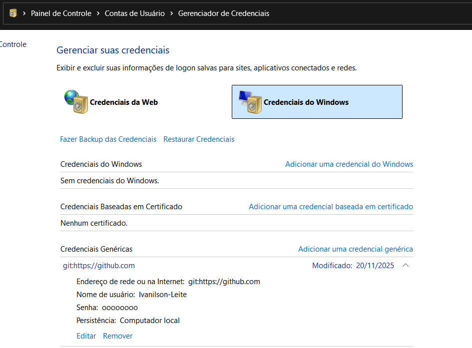

# Site STL Consulting

Etapa 1
Site com funcionalidades básicas:
Home
Contato funcionando
Módulos
-Livros, inserir um resumo dos livros para baixar (Ardillis)
-Carometro, portfólio e demais arquivos de Ardillis (Ardillis)
-Inserir um bloco de anotações para o mentor e o mentorado

Etapa 2
Site com funcionalidades de login:
Login / Recuperação de senha
Aquisição dos módulos de mentoria individual
Agendamentos

Etapa 3
Site com funcionalidades financeiras:
Compras
Cobranças

#==================================================================================================#

Ativar o túnel gratuito da Cloudflare

cloudflared tunnel --config C:/Users/ivani/.cloudflared/config.yml run app

ou

cloudflared tunnel --config config.yml run app

#==================================================================================================#

No VS Code mudar as credenciais para fazer commit
-- Iniciar -- Gerenciar suas credenciais -- Credenciais do Windows -- Credenciais Genéricas (Editar)

Acesso GitHub:
Usuário: stl-consulting-ardillis
Senha: Stl@2025

#==================================================================================================#

Acesso Cloudflare

Usuário: STL_consulting@hotmail.com
Senha: STL@2025
